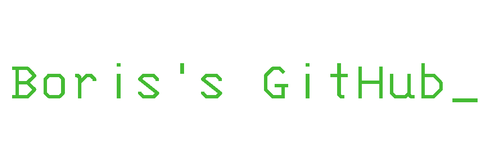

Hi, for more info about me, please visit my webpage [Boris's Webpage](https://barysk.codeberg.page/).

And here's a quick overview of some cool stuff I made:

## Projects

* [HTTP Server](https://github.com/Barysk/server_http) [ C ] - HTTP server written in C. The type of project that should have been at uni.
* [Micro Audio](https://github.com/Barysk/microaudio) [ C ] - Micro Linux/ALSA C playback library.
* [Minesweeper](https://github.com/Barysk/minesweeper) [ C ] - A Minesweeper game programmed in one go, in one evening.
* [EarthShift](https://github.com/Barysk/EarthShift) [ Odin / Raylib ] - Game prototype that was made during the ``Artificial Intelligence Methods in Game Design'' class. The game itself will continue it's development.
* [Noster: Hope](https://github.com/Barysk/noster_hope) [ GDScript ] - Multiplayer game, made for my engineering degree.
* [Castlevania 1986](https://github.com/Barysk/castlevania_1986_godot) [ GDScript ] - Project made during Game Design course, and is a recreation of the first stage of the 1986 Castlevania game.
* [SSFv2](https://github.com/Barysk/SSFv2) [ C++ ] - A small remake of the SSFv1 game.
* [SSFv0](https://github.com/Barysk/SSFv0) [ Python ] - Small project, made during Operating Systems course, to learn more about multithreading.
* [SSFv1](https://github.com/Barysk/SSFv1) [ GDScript ] - I wanted to make my first game, I made it.

## Projects I call Software

* [Reiha (レイハ)](https://github.com/Barysk/reiha) [ Rust ] - A minimalistic tool for making presentations using plain text file.
* [testownik_cli (テステル)](https://github.com/Barysk/testownik_cli) [ Odin ] - An app for solving tests created by PWr students.
* [archdruid](https://github.com/Barysk/archdruid) [ Bash ] - A simple script that configures a clean Arch Linux-Zen installation.
* [tools](https://github.com/Barysk/tools) [ Odin / Bash ] - Small handy tools.

## WIP Projects

* ***Access denied*** [ Odin / GLSL ] - An open-sourced (once done) bullet-hell focused 2d/3d game engine. 
* ***Access denied*** [ C# / ASP.NET ] - details are not available.

## Configs

### Tools:

* [NeoVim Poporu Config](https://github.com/Barysk/nvim) [ Lua ]
* [NeoVim Deboru Colorscheme](https://github.com/Barysk/nvim_deboru_colorscheme) [Lua]
* [seine_layout](https://github.com/Barysk/seine_layout) [ xkb / Shell ] - A qwerty and dvorak layouts with sane symbol placement for better programmer experience.

### WMs:

* [Hyprland](https://github.com/Barysk/dot_hyprland) [ Lua / CSS / Bash ]
* [DWM](https://github.com/Barysk/dot_dwm) [ C / Bash ]
* [DWL](https://github.com/Barysk/dot_dwl) [ C / Bash ]
* [River](https://github.com/Barysk/dot_river) [ Bash / CSS / Odin ]
